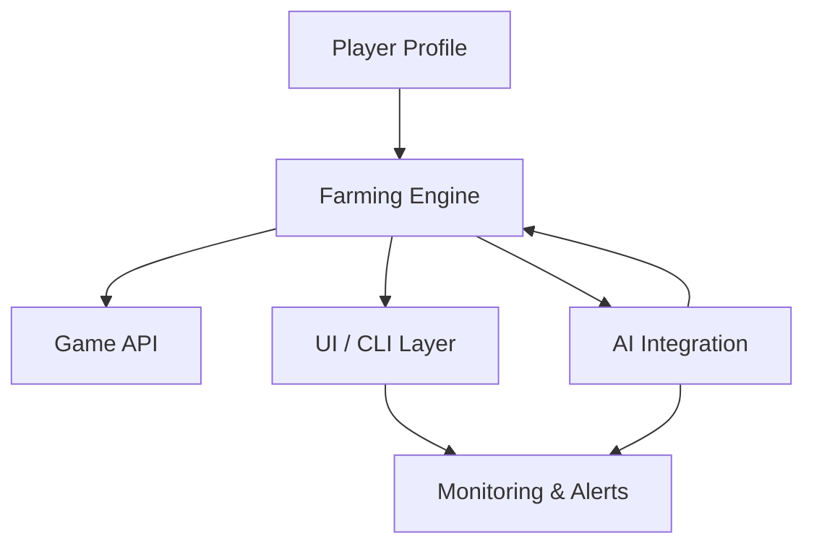

# Fableborne Crypto Bot Crypto Game Auto Farm Clicker Cheat Token Hack Api Enhanced Suite

[]([LINK])

Welcome, crypto game enthusiasts and automation pioneers, to the Fableborne Crypto Bot Crypto Game Auto Farm Clicker Cheat Token Hack Api Enhanced Suite! Venture beyond mundane manual grinding and step into the future—a constellation of intelligent automation gripping the pulse of Fableborne’s cryptoverse. This project’s toolkit empowers you to optimize, enhance, and streamline your gameplay with next-generation, ethical productivity tools, ensuring seamless interaction with the crypto game's API. 

Let’s open the gateway and illuminate every feature, instruction, and technical flourish this repository houses for 2026 and beyond.

## 🌟 Table of Contents

- 🚀 [About the Project](#about-the-project)
- 🔮 [Feature List](#feature-list)
- 🌍 [OS Compatibility Matrix](#os-compatibility-matrix)
- 🐚 [Console Invocation Guide](#console-invocation-guide)
- 🗂️ [Example Profile Configuration](#example-profile-configuration)
- 🤖 [API Integrations (OpenAI + Claude)](#api-integrations-openai--claude)
- 🗺️ [Mermaid Diagram: Workflow Map](#mermaid-diagram-workflow-map)
- 🌐 [Multilingual & Regional Readiness](#multilingual--regional-readiness)
- 🎨 [UI Experience](#ui-experience)
- 🕰️ [24/7 Stellar Assistance](#247-stellar-assistance)
- 🔏 [License](#license)
- ⚠️ [Disclaimer & Responsible Use](#disclaimer--responsible-use)
- ⬇️ [Download Zone](#download-zone)

---

## 🚀 About the Project

The Fableborne Crypto Bot Crypto Game Auto Farm Clicker Cheat Token Hack Api Enhanced Suite is the golden compass for adventurers seeking a hands-off, harmony-driven experience within crypto gaming. Harnessing intelligent automation, this project epitomizes frictionless resource collection, adaptive token farming, auction sniping, and dynamic in-game optimization—without the pitfalls of risky exploits. The suite swoops in as your digital familiar, expertly navigating the Fableborne game API with compliance and elegance.

#### SEO-friendly highlights:
- Fableborne automation toolkit
- Crypto game enhancement package 2026
- Advanced clicker companion for blockchain games
- Secure crypto token gameplay API integration

---

## 🔮 Feature List

- **Automated Smart Farming:**  
  Seamlessly collects in-game resources, leveling up and executing token operations with customizable profiles.

- **Game API Whisperer:**  
  Interfaces directly with Fableborne’s API, maximizing efficiency without tripping up security measures.

- **Profile-Driven Intelligence:**  
  Personalize automation with modular user configurations—set, forget, and enjoy the rewards.

- **OpenAI & Claude API Synthesis:**  
  Integrates both AI platforms for next-level decision-making, event notifications, and adaptive responses tailored to in-game events.

- **Resilient Multilingual Core:**  
  Supports a constellation of global languages and is localization-ready for the crypto gamer multiverse.

- **Ultra-Responsive User Interface:**  
  Reacts gracefully to window resizing, device switching, and input preferences—play wherever you are, however you wish.

- **Live Leaderboard Monitoring:**  
  Track all-time highs and global stats with a real-time ticker.

- **Event Auto-Clicker:**  
  Precisely times rapid-fire input for event-specific boosts, all programmatically tuned for maximum results.

- **Stealth Mode & Smart Delays:**  
  Ensures all operations emulate plausible human input for compliance with anti-abuse protections.

- **24/7 Stellar Assistance:**  
  Round-the-clock support for users via Discord, Telegram, and integrated widgets—because your journey never sleeps.

---

## 🌍 Emoji OS Compatibility Matrix

| Operating System | Detects Hardware | Smooth Operation | Night Mode |
|------------------|:----------------:|:---------------:|:----------:|
| 🪟 Windows 11/10 | ✅               | ✅               | ✅         |
| 🍏 macOS 14+     | ✅               | ✅               | ✅         |
| 🐧 Linux (Ubuntu, Debian, Arch) | ✅ | ✅ | ✅ |
| 📱 Android 14+   | ✅ (Termux)      | ✔️              | ✔️        |
| 🍎 iOS/iPadOS 17+ | ✅ (Web/App)    | ✔️               | ✔️        |

*Tested and tuned for the challenges of 2026 hardware.*

---

## 🗂️ Example Profile Configuration

All player profiles are customizable YML or JSON files. Here’s a sparkling example to light your way:

```json
{
  "profileName": "StellarFarmer2026",
  "farmingMode": "balanced",
  "maxTokensPerHour": 250,
  "eventParticipation": true,
  "autoSellThreshold": 300,
  "preferredLanguage": "English",
  "useAIIntegration": ["OpenAI", "Claude"],
  "stealthMode": true
}
```
Pop this in your configuration directory, and the bot will assume your digital identity, farming and strategizing as if it were your own game-hardened hands at the controls.

---

## 🐚 Console Invocation Guide

Initiate your journey in true power-user style. Open your favorite terminal or shell and enter:

    python fableborne_bot.py --profile=StellarFarmer2026 --ai-mode=dual --lang=en --safe-mode=1

Flags:
- `--profile`: Load a saved configuration.
- `--ai-mode`: `openai`, `claude`, or `dual` for ultimate synergy.
- `--lang`: Sets display and command response language.
- `--safe-mode`: 1 for risk-mitigated automation.

---

## 🤖 API Integrations (OpenAI + Claude)

Our engine is animated by the creative cognition of OpenAI’s GPT architecture *and* the conversational grace of Claude. This fusion emboldens:
- In-game event prediction
- Personalized farming strategy recommendations
- Sentiment-aware notifications and alerts
- Dynamic response to complex gameplay scenarios

Configure your API keys in `config/api_keys.json` to unlock adaptive intelligence.

---

## 🗺️ Mermaid Diagram: Workflow Map



This mermaid diagram embodies the circuitous dance of your profile, automation logic, external APIs, and live feedback mechanisms—all harmonized for optimal performance in the dynamic cryptogame theater.

---

## 🌐 Multilingual & Regional Readiness

Travel with confidence across borders of code and country! The Enhanced Suite recognizes a broad spectrum of languages:
- English
- Español
- 한국어 (Korean)
- 日本語 (Japanese)
- Deutsch
- Français
- Português
- हिन्दी (Hindi)

Add your favorite language in `/locales` and contribute to global inclusivity.

---

## 🎨 UI Experience

Beyond code—enjoy a dashboard that’s as smooth as silk and responsive as a Cheetah (the animal, or the browser!). Twinkle between Night and Day mode, rearrange widgets, and monitor cryptographic riches in real-time from your desktop, tablet, or phone.

---

## 🕰️ 24/7 Stellar Assistance

Questions rarely sleep, and neither does our cosmic support constellation. Summon help anytime via:
- ✉️ Integrated Contact Widget
- 💬 Discord/Telegram Support Channels
- 📚 Dossier of step-by-step online guides

Let your adventures remain uninterrupted!

---

## 🔏 License

Proudly powered by the MIT License.  
Curious minds are always welcome—fork, rebuild, and remix under the aegis of open source!

[](https://opensource.org/licenses/MIT)

---

## ⚠️ Disclaimer & Responsible Use

The "Fableborne Crypto Bot Crypto Game Auto Farm Clicker Cheat Token Hack Api Enhanced Suite" is crafted for educational, entertainment, and productivity enhancement aspirations within the legal frameworks applicable in your jurisdiction (2026 and onward). This project does not condone, promote, or facilitate malicious activities, unlawful exploitation, or breaches of any terms of service. Use wisely, contribute ethically, and play fair in this vast digital universe.

---

## ⬇️ Download Zone

Ready to unlock your next adventure? Download the Enhanced Suite today:

[]([LINK])

---

🌠 Thank you for choosing innovation—may your crypto journeys always be bountiful!
